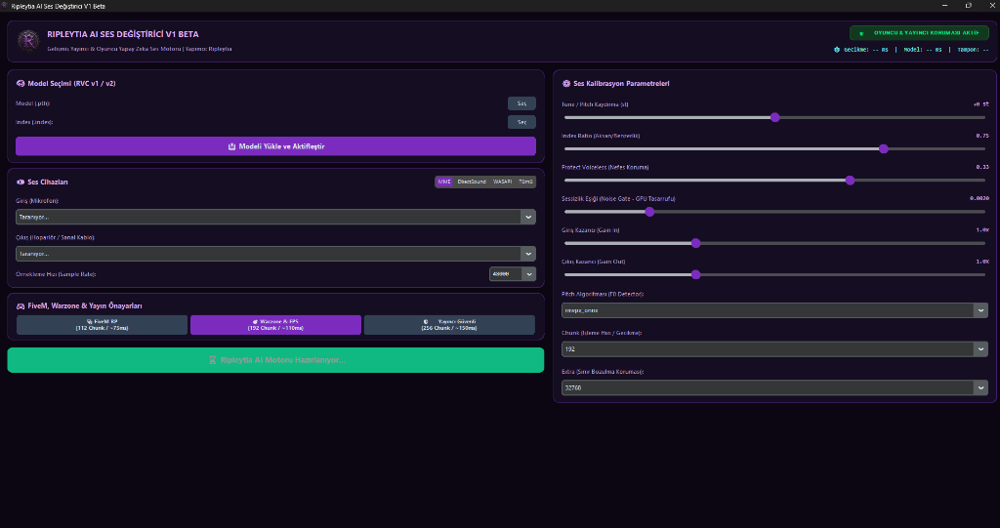

# 🎙️ Ripleytia AI Ses Değiştirici V1 Beta
> **Gelişmiş Yayıncı & Oyuncu Yapay Zeka Gerçek Zamanlı Ses Dönüştürücü**  
> **Yapımcı:** Ripleytia



---

### ⚠️ ÖNEMLİ BİLGİLENDİRME (BETA SÜRÜMÜ)
> [!WARNING]
> **Bu uygulama henüz V1 BETA aşamasındadır.**
> Geliştirilme süreci devam etmekte olup; farklı donanım konfigürasyonlarında, sanal ses kablosu sürücülerinde veya yoğun oyun senaryolarında beklenmedik hatalar, ses kesilmeleri ya da sürücü uyumsuzlukları ile karşılaşabilirsiniz. Hata bildirimlerinizi GitHub Issues sekmesinden iletebilirsiniz.

---

### ✨ Öne Çıkan Özellikler

* **🎭 FiveM RP ve Telsiz Kalibrasyonu**: RP sunucularında anlık konuşmalar için ultra düşük gecikme (**~75 ms**). Telsiz ve diyaloglarda gecikme hissedilmez.
* **🎯 Warzone & Rekabetçi FPS Uyumluluğu**: Yoğun çatışma anlarında GPU %100'e dayansa bile ses tamponunu korur, takılma ve robotlaşmayı önler.
* **🛡️ Yayıncı Koruma Modu (OBS / Kick / Twitch)**: Saatlerce süren canlı yayınlarda sıfır mikro-takılma garantisi.
* **⏱️ Windows 1ms Donanımsal Zamanlayıcı Kilidi (`timeBeginPeriod`)**: Windows'un arka plan uyku dalgalanmalarını 1 ms'ye indirgeyerek seste sıçramaları engeller.
* **⚡ 1.4 GB VRAM Güvenlik Kalkanı**: Yapay zekanın aşırı VRAM harcamasını engelleyerek OBS Studio ve oyunlar için **6.6 GB+ VRAM'i tamamen serbest** bırakır.
* **🔇 Akıllı Sessizlik Eşiği (Noise Gate)**: Konuşmadığınız anlarda yapay zeka GPU kullanımını **%0'a** düşürür. Ekran kartınız boş yere yorulmaz.
* **🟣 Ripleytia Gothic Mor Tasarımı**: Özel karanlık mor siberpunk arayüz, anlık değişen sayısal göstergeler ve canlı MS gecikme monitörü.

---

### 🚀 Hızlı Başlangıç & Kurulum

#### 1. Gereksinimler
- **İşletim Sistemi**: Windows 10 / 11 (64-bit)
- **Ekran Kartı**: NVIDIA RTX / GTX (CUDA Desteği Önerilir)
- **Python**: Python 3.10.x önerilir
- **Sanal Ses Kablosu**: VB-Audio Virtual Cable (Discord, OBS ve oyunlara sesi aktarmak için)

#### 2. Kurulum ve Çalıştırma (Tek Tıkla Otomatik)
1. Bu depoyu indirin (ZIP veya Git klonu):
   ```bash
   git clone https://github.com/ripleytia/Ripleytia-AI-Voice-Changer.git
   cd Ripleytia-AI-Voice-Changer
   ```
2. **`run.bat`** dosyasına çift tıklayın!
   * **Akıllı Otomatik Kurulum:** Sistem ilk açılışta Python ortamını, GPU (CUDA) PyTorch desteğini ve tüm kütüphaneleri otomatik olarak algılayıp kurar.
   * Dilerseniz manuel olarak önce `install.bat` dosyasını çalıştırabilir, ardından `run.bat` ile açabilirsiniz.

---

### 🎮 Hazır Oyun & Yayın Profilleri

| Profil | Chunk | Hedef Gecikme (ms) | En Uygun Senaryo |
| :--- | :---: | :---: | :--- |
| **🎭 FiveM RP** | 112 | ~75 ms | FiveM, GTA RP, Discord sohbeti (En hızlı yanıt) |
| **🎯 Warzone & FPS** | 192 | ~110 ms | Warzone, Apex Legends, Valorant vb. rekabetçi oyunlar |
| **🛡️ Yayıncı Güvenli** | 256 | ~150 ms | OBS üzerinden yüksek bitrate yayınlar |

---

### 📜 Lisans & Teşekkür
* Bu proje **MIT Lisansı** altında lisanslanmıştır.
* **Yapımcı:** Ripleytia
* Taban motor mimarisinde W-Okada açık kaynak RVC araştırmalarından esinlenilmiş, oyuncular ve yayıncılar için optimize edilmiştir.
